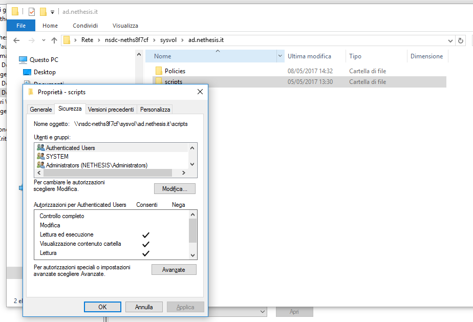
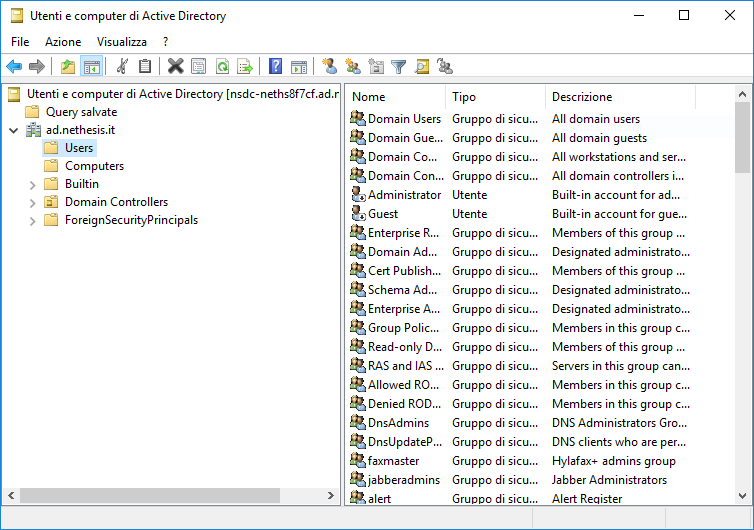
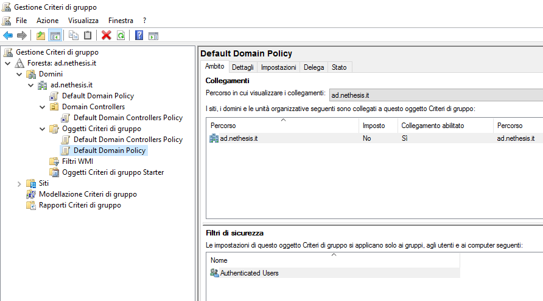
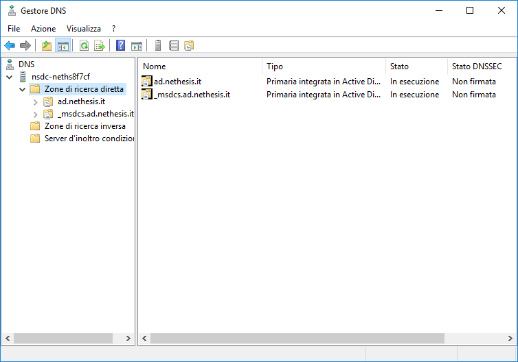
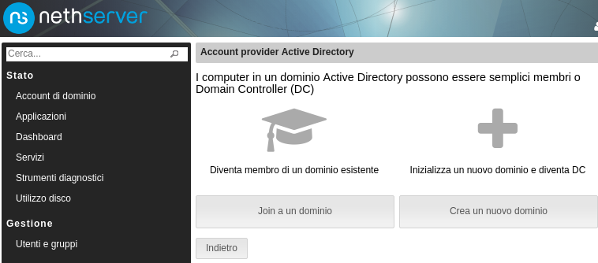
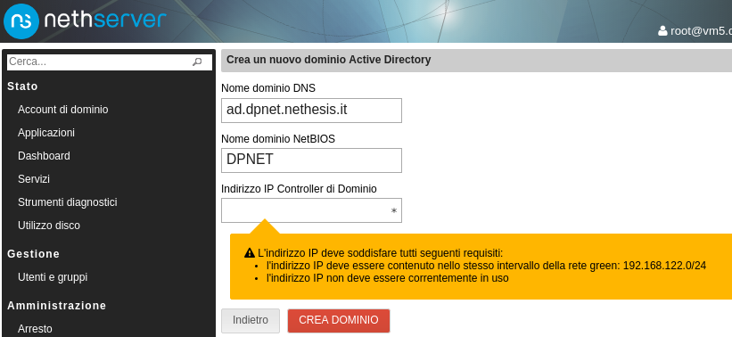

# Come realizzare<br> un Domain Controller Active Directory<br> con Linux e Samba 4

<i class="fa fa-database" aria-hidden="true"></i>

22 Novembre '17 &ndash; *Inside E-Learning*

[@davideprincipi](https://twitter.com/davideprincipi) - [@NethServer](https://twitter.com/NethServer)

---

## Il progetto Samba

*opening windows to a wider world*

* (Re)Implementazione dei protocolli SMB/CIFS per la condivisione di file/stampanti in rete <!-- .element: class="fragment" -->

* Nato in Australia nei primi anni '90 <!-- .element: class="fragment" -->

* Software Libero (licenza GNU/GPLv3) <!-- .element: class="fragment" -->

* Disponibile Unix, OpenVMS, Unix-like...  <!-- .element: class="fragment" --> <span>(Linux)</span> <!-- .element: class="fragment" -->

<div class="footnotes">http://www.samba.org &ndash; fonte [Wikipedia](https://en.wikipedia.org/wiki/Samba_(software)</div>

Note:

    - 25 anni di sviluppo

---

## Samba Active Directory

* Implementazione dei protocolli di rete di Microsoft Active Directory&trade; (DNS, LDAP, Kerberos, ...)<!-- .element: class="fragment" -->

* Disponibile da Samba 4.0<br>rilasciata l'11 dicembre '12 <!-- .element: class="fragment" -->

* <div>Nuovo ruolo **domain controller** si aggiunge al già esistente *ADS* in smb.conf:<br><code style="font-size: smaller">server role = active directory domain controller</code></div> <!-- .element: class="fragment" -->


---

## Samba release cycle <span>¹</span> <!-- .element: class="fragment"  data-fragment-index="1" -->

| fase | durata | esempio |
| ---- | ------ | ------- |
| full support | 6 mesi | <span class="fragment"  data-fragment-index="1">2017-03-07</span> |
| maintenance | 6 mesi | <span class="fragment"  data-fragment-index="1">2017-09-21²</span> |
| security fixes | 6 mesi | <span class="fragment"  data-fragment-index="1">da 2018-03, EOL 2018-09</span> |

-----


<div class="leftalign fragment" data-fragment-index="1">¹ Esempio per la release 4.6</div>

<div class="leftalign fragment" data-fragment-index="2">² Ci sono tre release *attive*: 4.7, 4.6, 4.5</div>

<div class="footnotes">fonte [Samba Wiki](https://wiki.samba.org/index.php/Samba_Release_Planning)</div>

---

## Il ruolo DC su CentOS 7 

<span>non c'è <i class="fa fa-frown-o" aria-hidden="true"></i></span> <!-- .element: class="fragment" -->

<div>
I sistemi Fedora e derivati (come RHEL, CentOS) non hanno il ruolo DC disponibile
```text
# rpm -ql samba-dc
/usr/share/doc/samba-dc-4.6.2/README.dc```
</div> <!-- .element: class="fragment" -->

---

``cat README.dc``

> The Samba build in Fedora is using <u>MIT Kerberos</u> implementation in order
> to allow system-wide interoperability between both desktop and server
> applications running on the same machine.

<div style="text-align: right">(continua)</div>

---

(segue)

> <span class="fragment strike" data-fragment-index="1">At the moment</span> the Samba Active Directory Domain Controller implementation is
> <span class="fragment strike" data-fragment-index="1">not</span> available with <u>MIT Kerberos</u>.

...sarà possibile quando RHEL/CentOS compileranno samba-4.7
rilasciata il 20 settembre '17<!-- .element: class="fragment"  data-fragment-index="1" -->

---

### Il ruolo DC su CentOS 7 

* Disponibile RPM samba-4.6 <span>*senza DC*</span> <!-- .element: class="fragment" -->

* <div>Possibile ricompilare dai sorgenti ufficiali Samba, includendo le librerie Heimdal Kerberos
```text
$ ./configure
$ make
$ sudo make install
```
</div> <!-- .element: class="fragment" -->

<div>...ma non possiamo installare pacchetti dipendenti da MIT Kerberos <i class="fa fa-frown-o" aria-hidden="true"></i></div> <!-- .element: class="fragment" -->

---

### Il ruolo DC su CentOS 7 &ndash; soluzione <span class="fragment strike" data-fragment-index="1">0</span> <span class="fragment fade-in" data-fragment-index="1">0.1</span>

* Ricompilare dai sorgenti ufficiali Samba

* Macchina (virtuale) dedicata esclusivamente al ruolo DC <span class="fragment strike" data-fragment-index="1">+ file server</span>

* Ruolo di file server su macchina separata con pacchetti distro ufficiali (RPM samba-4.6) <!-- .element: class="fragment"  data-fragment-index="1" -->

---

### Perché separare i ruoli (1)

> Su installazioni più grandi il sapere che il file server e il DC possono essere configurati,
> aggiornati e replicati in maniera indipendente sarà di lunga più importante, quindi
> ti consiglio di separare i ruoli. &ndash; [Andrew Bartlett](https://lists.samba.org/archive/samba/2013-March/172156.html) (Samba Team)

---

### Perché separare i ruoli (2)

* Almeno per il ruolo di file server i pacchetti ufficiali della distro sono stabili

* Contengono le patch di sicurezza testate

* Aggiornamenti automatici

* <div>Invece, ricompilare "a mano" ci costringe a testare e aggiornare noi: una bella fatica! <i class="fa fa-wrench" aria-hidden="true"></i></div> <!-- .element: class="fragment" -->

---

### Perché separare i ruoli (3)

Il ruolo di file server da solo ammette:

* Posix ACL: integrazione con altre applicazioni

* Windows ACL: completa compatibilità Windows

Il ruolo DC accetta solo la modalità Windows ACL <!-- .element: class="fragment" -->

---

## Linux containers

* virtualizzazione *leggera*

* *chroot on steroids*

* oltre 10 anni di sviluppo

* i container condividono lo stesso kernel <!-- .element: class="fragment" -->

---

## Linux containers su CentOS 7

* Preparare filesystem<br> ``yum --installroot=/var/lib/machines/dc1 install centos-release systemd-networkd …``  <!-- .element: class="fragment smallcode" -->

* Avviare <br> ``systemd-nspawn --boot --machine dc1 …``  <!-- .element: class="fragment smallcode" -->

* Ottenere una shell <br> ``systemd-run -M dc1 -t /bin/bash``  <!-- .element: class="fragment smallcode" -->

---

### Il ruolo DC su CentOS 7 &ndash; soluzione 1

* Una macchina (fisica o virtuale) con ruolo file server, <span>RPM distro ufficiale</span> <!-- .element: class="fragment"  data-fragment-index="1" -->

* Un Linux container con ruolo DC, <span>[Samba DC ricompilato](https://github.com/NethServer/ns-samba/releases)</span> <!-- .element: class="fragment"  data-fragment-index="1" -->

* Molti ruoli sullo stesso sistema <!-- .element: class="fragment"  data-fragment-index="2" -->

* Dall'esterno appaiono due indirizzi IP distinti <!-- .element: class="fragment"  data-fragment-index="2" -->

---

## Amministrazione AD su Linux

* Permessi filesystem

* [RSAT tools](https://wiki.samba.org/index.php/Installing_RSAT)

  * Gestione utenti

  * Criteri di gruppo (group policy object &ndash; GPO)

  * Gestione DNS


---

### Permessi filesystem



---

### Gestione utenti



---

### Criteri di gruppo

* I GPO non si applicano al Samba DC stesso

* Non è implementato un meccanismo di replica di SYSVOL



<div class="footnotes">rif. [Samba Wiki](https://wiki.samba.org/index.php/DNS_Administration)</div>

---

### Gestione DNS



<div class="footnotes">rif. [Samba Wiki](https://wiki.samba.org/index.php/DNS_Administration)</div>

---

## NethServer

* *all-in-one, modular server solution*

* Progetto open source internazionale, nato in Italia nel 2012

* Comunità di sysadmin Windows e/o Linux, esperti&nbsp;e&nbsp;non, inclusiva e attiva<br> http://community.nethserver.org


---

## Anatomia di NethServer

|   |    | |
| - | ------ | ------------------------ |
| 3 | Web UI | Server Manager ⇨ <b>Nethgui</b> |
| 2 | Configuration manager | DB, events, templates, actions ⇨ <b>e-smith</b> |
| 1 | Upstream distro | CentOS 7 |

---

## Active Directory su NethServer 7



---

## Active Directory su NethServer 7



---

<i class="fa fa-database" aria-hidden="true"></i>

[@davideprincipi](https://twitter.com/davideprincipi) - [@NethServer](https://twitter.com/NethServer)
